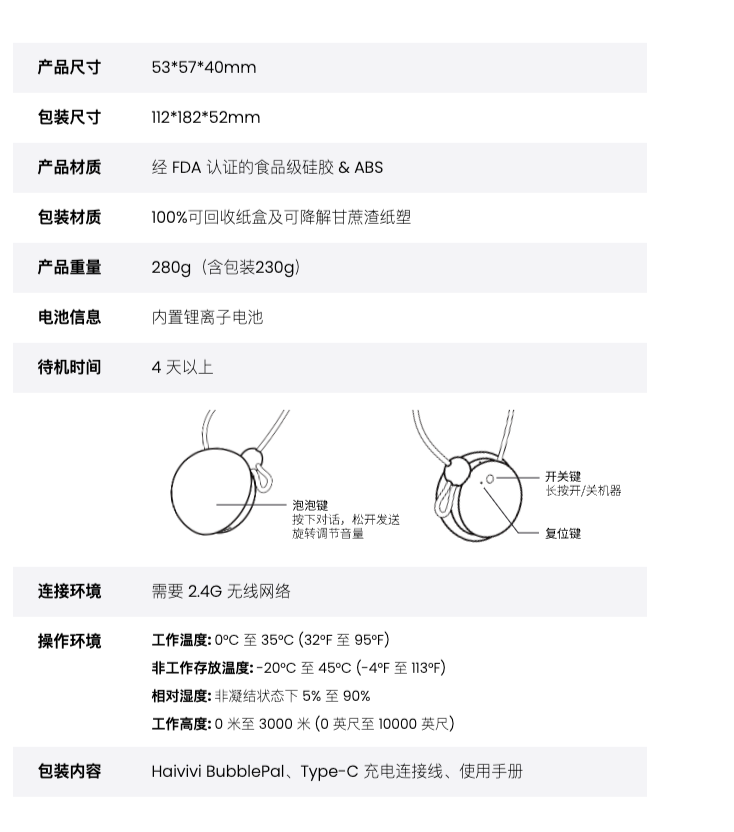

# bubblepal

介绍：https://www.itsjzx.com/327386.html

介绍：[499元一个的AI毛绒玩具Bubblepal，回答人类幼崽十万个为什么](https://baijiahao.baidu.com/s?id=1805337137291270457&wfr=spider&for=pc&searchword=bubblepal%20ai%E7%8E%A9%E5%85%B7)

官网：[Haivivi 跃然创新 - 官方网站](https://www.haivivi.cn/zh)介绍：[做有“温度”的科技陪伴，BubblePal AI玩具，智能更懂需求 - IT手机资讯](https://www.itsjzx.com/327386.html)

介绍：[499元一个的AI毛绒玩具Bubblepal，回答人类幼崽十万个为什么](https://baijiahao.baidu.com/s?id=1805337137291270457&wfr=spider&for=pc&searchword=bubblepal%20ai%E7%8E%A9%E5%85%B7)

官网：[Haivivi 跃然创新 - 官方网站](https://www.haivivi.cn/zh)

泡泡伙伴。据说是为孩子定制的AI大模型，外观是一个小圆球，搭配一个挂绳，可以陪孩子聊天。孩子可以把这个小圆球，安装在毛绒玩具或者机器人玩具上，玩具就有了开口说话的效果。据说泡泡伙伴的定位，就是带有教育属性的玩具，孩子可以在跟AI聊天的过程中学到一些知识

功能特点：

* 多角色俩天

* 超级百科

* 讲故事

* 游戏达人

* 美好回忆

